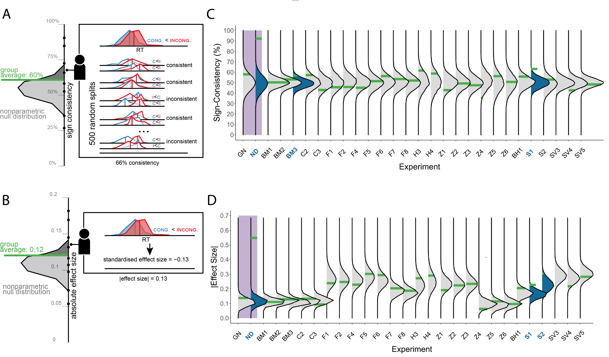

```{r setup, include = FALSE}
library("papaja")
r_refs("r-references.bib")

```

```{r initialize, warning = FALSE}
# Seed for random number generation
set.seed(42)
knitr::opts_chunk$set(cache.extra = knitr::rand_seed)

library(groundhog)
groundhog.library(c(
  'ggplot2',
  'stringr',
  'gridExtra',
  'ggh4x',
  'foreach',
  'ggtext',
  'ggridges',
  'ggpubr',
  'scales',
  'dplyr',
  'tidyr',
  'pracma',
  'extraDistr',
  'patchwork',
  'MCMCpack',
  'BayesFactor',
  'xfun'), '2023-07-22')
# from github (Commit: 0e04c3c)
library(signcon)
  
source('datasets_analysis\\utils.R')
source('datasets_analysis\\definitions.R')

# extract the datasets results from the zipped results file
unzip('results\\results.zip', exdir = 'results\\')
```

```{r run-analyses, include=FALSE}
# run all analyses. The outputs are later used in the script
# to preprocess all datasets source the preprocessing script,
# sourcing this script will also download the up-to-date version of the confidence database from OSF (not the version used for analysis in this paper).
# source('datasets\\run_preprocessing.R')
# run all analysis on the preprocessed datasets
# source('datasets_analysis\\run_all_analyses.R')

# sourcing the 'fig1sim' script generates the panels populating Figure 1 in the manuscript, and analyzes the simulated data with all available non-directional (here we used an edited version of this panels)
# tests, and t-tests.
source('figures\\fig1sim.R')
# sourcing the 'fig2_3' script generates figure 2, the lower panel of figure 3, and supplementary figure 1,2 (note that figure 3 was edited to also include the illustration in the upper panel of figure 3)
# it also analyzes the results of all unconscious processing datasets according to all tests
source('figures\\fig2_3.R')
# sourcing the 'fig4' script generates figure 4 (minor edits were applied to the resulting svg figure).
# it also analyzes the results of all datasets (including datasets from non-UC domains) according to the sign consistency test.
source('figures\\fig4.R')

# we run the analysis of appendix A right before presenting the appendix (see below).

# the analysis and simulations for appendix B.
# to run the analysis again, uncomment the (commented) run_appendixB line and comment the read.csv line which reads the results of an existing simulations run.
source('appendix\\appendix_B.R')
# appendixB_res <- run_appendixB(apndxB_conf_FAs, apndxB_conf_sensitivity)
appendixB_res <- read.csv('appendix\\results\\2024-01-07_23_39_16Appendix_B_QUID_OANOVA.csv')

# the analysis and simulations for appendix C.
# to run the analysis again, uncomment the (commented) run_appendixC line and comment the read.csv line which reads the results of an existing simulations run (keeping the save_plot_appendixC line.)
source('appendix\\appendix_C.R')
# appendixC_res <- run_appendixC(apndx_b_conf)
appendixC_res <- read.csv('appendix\\results\\2023-12-29_18_48_11Appendix_C.csv')
save_plot_appendixC(appendixC_res)

# appendix D was not implemented in an external script.
# see the implementation below

# the materials for appendix E are generated by sourcing the
# 'figure4.R' script, and the its figure was created with minor
# edits applied to the output files

# the analysis and simulations for appendix F.
# to run the analysis again, uncomment the (commented) run_appendixF line and comment the read.csv line which reads the results of an existing simulations run.
source('appendix\\appendix_F.R')
apndxF_N_p <- N_p
apndxF_N_t <- N_t
# appendixF_res <- run_appendixF(apndx_e_conf)
appendixF_res <- read.csv('appendix\\results\\2024-01-09_16_46_09Appendix_F.csv')
apndx_F_median_cnd_power <- appendixF_res %>%
  filter(N_p == median(appendixF_res$N_p), 
         N_t == median(appendixF_res$N_t),
         sds_ratio == median(appendixF_res$sds_ratio)) %>%
  pull(Power)
```

```{r abstract-code, include=FALSE}
# we used fixed numbers on the abstract, here is the code to recreate them.

# get the number of participants and effects in the ucdb
ucdb_conf <- init_analysis(Unconscious_Processing_analysis_lbl)
ucdb_dfs <- get_input_df(ucdb_conf)
res_summary_fn <- 'Unconscious Processing_Results.csv'
results_fld <- 'results'
alpha <- .05
# read the ucdb results file
results <- read.csv(paste(results_fld, res_summary_fn, sep=.Platform$file.sep))
# filter the number of ns (non-significant) directional effects
ns_results <- results[results$directional_test.p > alpha,]
N_ns <- length(unique(ns_results$exp))
directional_effect_datasets <- setdiff(unique(results$exp), unique(ns_results$exp))
# count participants
ns_N_participants <- ucdb_dfs %>%
  group_by(exp) %>%
  filter(!exp %in% directional_effect_datasets) %>% 
  summarise(n = length(unique(idv)))
# removing experiments where the same participants were included in different
# effects
N_unique_participants <- sum(ns_N_participants %>% 
         filter(!exp %in% c('Faivre et al._1_incong', 'Faivre et al._3_incong', 
                            'Faivre et al._4_incong', 'Hurme et al_2020_TMS_Red', 
                            'Stein & van Peelen_2020_3_PAS_2', 'Zerweck et al_2021_3_Duration_20',
                            'Zerweck et al_2021_3_Duration_30', 'Zerweck et al_2021_2_39', 
                            'Zerweck et al_2021_2_29')) %>%
                            dplyr::pull(n))
```


# Introduction
Our brains simultaneously perform complex information processing functions and yet, at any given moment in time, only a small subset of these functions is accompanied by conscious experience. This raises the question: which brain functions depend on consciousness, and which functions can take place without it? 

One approach to investigating the scope and limits of unconscious processing is to measure the effect of different stimulus features on behaviour, while making sure that the stimulus itself is not consciously perceived (for review, see @kouider2007a; @reingold1988a). If a stimulus feature affects behaviour even when the participant is not aware of the stimulus, being conscious of the stimulus cannot be necessary for processing that feature.

For example, Vorberg and colleagues [-@vorberg2003a] studied the role of consciousness in motor preparation. In a series of experiments, they presented an arrow stimulus (henceforth, the prime) which was followed by an arrow-shaped metacontrast target stimulus, rendering it invisible (@breitmeyer1976a; see Figure 1A). Unconscious motor preparation priming was demonstrated by showing that participants responded faster to the target stimulus when its direction was congruent with the direction of the prime. This suggests that the direction of the prime has been represented unconsciously, triggering a motor plan. In similar studies, participants were reported to unconsciously perform high-level functions such as arithmetic operations [@sklar2012a], extract and integrate word meanings [@damian2001a; @gaal2014a; @sklar2012a], or scenes and objects [@mudrik2011a], detect errors [@charles2013a], and exert inhibition over responses [@gaal2008a] to stimuli that were masked from awareness. Findings of high-level processing in the absence of consciousness served to inform and reform theories of consciousness [@dehaene2001a; @oizumi2014a; @lamme2020a; @lau2011a].

However, more recent work has called into question some of these previous findings and their interpretations. First, many of the original results do not replicate when tested in independent samples of participants (using direct replications, e.g., @biderman2018a; @moors2019a; @stein2020a, or conceptual replications, e.g., @hesselmann2015a; @hesselmann2016a; @rabagliati2018a). Second, some of these findings might be driven by residual consciousness in a subset of trials due to unreliable awareness measures [@shanks2017a; @meyen2022a; @zerweck2021a; @moors2018a; @rothkirch2017a]. Indeed, when re-analyzed to properly control for this possibility, some of these effects disappear [@shanks2017a; @meyen2022a]. As a result, the scientific pendulum seems to be receding back to a narrower account of unconscious processing, consistent with a functional role of consciousness in most aspects of cognition [@balota1986a; @peters2017a; @moors2017a; @meyen2022a].

Overall, the field is still far from reaching a consensus regarding the scope and limits of unconscious processing. Although progress has been made in recent years toward improving methodology in unconscious processing studies, revealing the functional role of consciousness in cognition and perception remains difficult. Here we consider a largely neglected limitation of unconscious processing studies: by focusing on the average of signed (i.e., directional) single-participant summary statistics (for example, subtraction of reaction times between two conditions), previous investigations require not only that unconscious processing should leave a trace on behaviour, but also that this trace should be qualitatively similar across different participants (i.e., that the experimental manipulation would affect most participants in the same direction). We note that though this second requirement is intuitive, it is orthogonal with the theoretical question at stake; our main concern is whether a given stimulus feature can affect behaviour in the absence of consciousness, yet this does not necessarily imply that it affects all participants in the same way. This way, previous analyses of unconscious processing may have been too *conservative*, potentially missing effects that happen to vary between different participants (for a similar argument regarding cognitive science in general see @ince2022a). 

On the face of it, pronounced individual differences in unconscious processing effects on cognition and perception seem possible, even likely. Indeed, previous investigations revealed heterogeneity in susceptibility to the attentional blink [@martens2006a], in the effects of stimulus onset asynchrony (SOA) on metacontrast masking [@albrecht2010a], the speed of breaking perceptual suppression [@sklar2021a], both in the breaking continuous flash suppression paradigm (b-CFS; [@jiang2007a] and the breaking repeated mask suppression one (b-RMS; [@abir2020a], and in the effects of visual imagery on conscious perception in a binocular rivalry setting [@dijkstra2019a]. Some qualitative differences have been linked to variability in processing speed [@martens2006a], genetics [@maksimov2013a], and brain anatomy and physiology [@gaal2011a; @boy2010a]. Critically, in other behavioural paradigms, unconscious stimuli had opposite effects on different participants. Bolger and colleagues [-@bolger2019a] showed that while most participants responded faster to upright faces in a b-CFS task, some responded faster to upside-down faces. Other findings from several different study groups have repeatedly revealed that masked priming effects changed in magnitude and even flipped in sign as a function of the interval between prime and target [@boy2014a; @boy2010b; @parkinson2014a; @schlaghecken2004a]. Moreover, different hypotheses were laid out over the years regarding the driving mechanisms of the counter-intuitive 'negative' priming effects. Among others, response inhibition of initial prime activations [@eimer2003a; @boy2010c], or neural habituation [@jacob2021a] were suggested. Taken together, it is not clear if, and to what extent, unconscious effects are subject to meaningful individual variability. Crucially, if they are, then some previously reported null results might actually be true effects, masked by such variability. 

The paper proceeds as follows. We first simulate a setting where a strong effect of unconscious processing on behaviour is entirely missed in standard analysis, due to pronounced inter-individual differences. We then show that the same effect is revealed when using three tests that are robust to population variability: the global null prevalence test [@donhauser2018a], Bayesian hierarchical modelling [@haaf2019a], and a test based on analysis of variance (ANOVA; [@miller2018a]. Importantly, unlike common measures of reliability which are used to directly estimate individual differences (see @parsons2019a), the above tests do not quantify individual differences, but *measure group effects in a way that is robust to such differences*. Hence, they provide researchers with the appropriate tools for detecting unconscious effects even if pronounced individual differences exist, without depending on that being the case. 

We then apply these tests to data gathered from eight unconscious processing studies (reporting 26 non-significant effects), and show that the same three tests support the null hypothesis according to which the behaviour of individual participants is unaffected by unconscious cognition and perception. This strengthens claims for a true absence of an effect in these studies. Finally, we propose a non-parametric alternative that provides improved sensitivity and specificity, avoiding potentially unjustified statistical assumptions regarding the data-generating process. Our test successfully reveals effects on multisensory integration, visual search, and confidence ratings that could not be detected using standard directional analysis. However, similar to the three other approaches, it reveals no effects when applied to the studies of unconscious processing examined here. We conclude that existing data are most consistent with the absence of influences of unconscious stimuli on cognition and perception, not only at the population, but also at the single-participant level. 

# Simulating non-directional unconscious effects 

To provide a conceptual demonstration of how true causal effects of unconscious processing can be masked by inter-individual differences in effect signs, we simulated a typical experiment using a within-participants manipulation (Figure 1). Specifically, we generated trial-by-trial data from a standard unconscious priming experiment. For each simulated participant, we generated reaction time data from two conditions (corresponding to congruent and incongruent primes in unconscious processing studies). Individual-level effect sizes (in milliseconds) were sampled from a normal distribution centred at zero ($e_{i} \sim {\mathcal{N}}(0, \sigma_{b})$, where $e_{i}$ denotes the true effect size of the $i^{th}$ participant and $\sigma_b$ the between-participant standard deviation. Then, the trial-by-trial reaction times (RTs) of each participant and condition were generated according to each participant's true effect score ($e_{i}$), the relevant condition ($c \in \{1, 0\}$, where $c=1$ denotes the incongruent condition, and $c=0$ denotes the congruent condition), and the within-participant standard deviation ($\sigma_{w}$) ($RT_{i,c} \sim {\mathcal{N}} (0, \sigma_{w}) +c*e_{i}$).^[Similar results were obtained with more realistic Wald RT distributions as detailed in Appendix A.]

In two simulations, we manipulated two factors: the between-participant standard deviation (SD) over effect sizes ($\sigma_{b}$), and the within-participant SD over RTs within each condition ($\sigma_{w}$). This resulted in two distinct scenarios under this framework: (1) a *qualitative* or *non-directional differences* scenario, where all individuals show an effect, but individual-level effects largely vary in magnitude and sign ($\sigma_{b}$=`r nde_sd_b`, $\sigma_{w}$=`r nde_sd_w`; Figure 1B)), and (2) a *global null* scenario [@allefeld2016a; @nichols2005a], where no single participant is affected by the experimental manipulation ($\sigma_{b}$=`r sn_sd_b`, $\sigma_{w}$= `r sn_sd_w`; Figure 1C). We simulated $N_{t}$=`r 2*sn_trials` trials from $N_{p}$=`r sn_n` participants per scenario, noting that the general principle holds for other sample sizes and number of trials.

First, we analyzed this simulated data using a two-sided paired t-test on the differences in mean RTs between the two conditions. This is the standard protocol for testing if unconscious processing took place. In both simulations, we obtained a null result, revealing no evidence for a difference in RT between the congruent and incongruent conditions (*non-directional differences*: `r apa_print(nde_t_test)$full_result`; *global null*: `r apa_print(sn_t_test)$full_result`). Importantly, in the *non-directional differences* simulation, all participants were affected by the experimental manipulation (that is, their true effect sizes were different from zero). Thus, this commonly used approach systematically misses true causal effects of the experimental manipulation whenever they are inconsistent between participants.

To reiterate, a standard t-test misses existing individual-level effects because, operating on individual-level summary statistics, it is oblivious to within-participant variability in the dependent variable. In recent years, researchers sought to address this limitation, advocating for the use of statistical methods that incorporate both within and between-participant variability. Specifically, three approaches were proposed. First, the *prevalence global null* approach (@donhauser2018a; henceforth GNT) tests if the prevalence of individual-level effects in a given population (the proportion of individuals showing an effect) is greater than zero. The prevalence approach relies on a two stages procedure. In the first stage, effects are tested at the individual level using a standard hypothesis-testing approach. In the second stage, the proportion of observed individual-level effects is tested against the alpha level, or type-1 error rate, using a binomial test. A significantly higher prevalence means the *global null* hypothesis, according to which no individual shows a true effect, can be rejected. Second, the *qualitative individual differences* approach (@rouder2020a; @rouder2021a; @haaf2019a; henceforth QUID) quantifies the relative support for the presence of “qualitative differences” in effects, that is, inter-individual differences in effect signs, by performing a Bayesian model comparison over a family of hierarchical models with different constraints [@haaf2019a]. Third, Miller & Schwarz [-@miller2018a] introduce a parametric and frequentist test, based on ANOVA. Specifically, their Omnibus ANOVA test (henceforth OANOVA) probes the joint null hypothesis that there are no systematic differences neither between experimental conditions across individuals, nor within individuals and across trials. Together, this is equivalent to the *global null* scenario we presented above.

We applied the tests to our simulated data. For QUID, we used the default priors from the original publication [@rouder2021a]. For GNT and OANOVA, we used an $\alpha$ of `r oanova_alpha` to examine individual-level and group-level effects. For QUID, we considered $BF>`r bf_criteria`$ as evidence for an effect, $BF< \frac{1}{`r bf_criteria`}$ as evidence for no effect (*global null*), and values between these thresholds ($\frac{1}{`r bf_criteria`}\leq BF\leq `r bf_criteria`$) as inconclusive [@jeffreys1998a]. Reassuringly, all tests were able to differentiate between the two simulated scenarios, providing very strong evidence for an effect in the *non-directional differences* scenario, but not in the *global null* one. Specifically, According to GNT, the prevalence of effects on RT was clearly above zero in the *non-directional differences* simulation (using a two-sided t-test for the individual-level test; `r round(100 * nde_gnt_res$stat,2)`% of significant effects, one-sided $CI_{95}$ = [`r round(100 * nde_gnt_res$ci_low,2)` `r round(100 * nde_gnt_res$ci_high,2)`], p `r apa_p(nde_gnt_res$p)`), but this proportion was not higher than $\alpha$ in the *global null* simulation (`r round(100 * sn_gnt_res$stat,2)`% of significant effects, one-sided $CI_{95}$ = [`r round(100 * sn_gnt_res$ci_low,2)` `r round(100 * sn_gnt_res$ci_high,2)`], p =`r apa_p(sn_gnt_res$p)`). Using the QUID method, a random effects model with individual-level effects was overwhelmingly preferred in the *non-directional differences* simulation ($BF$= `r formatC(nde_bf, format = 'e', 2)`), but a null model was preferred in the *global null* simulation ($BF$= `r round(sn_bf,2)`). Similarly, the OANOVA test revealed significant results in the *non-directional differences* scenario (F(`r nde_OANOVA_res$df_num`, `r nde_OANOVA_res$df_denom`) = `r round(nde_OANOVA_res$F,2)`, p `r paste0(ifelse(nde_OANOVA_res$p >= .001, '=', ''), apa_p(nde_OANOVA_res$p))`), and a non-significant effect in the *global null* simulation (F(`r sn_OANOVA_res$df_num`, `r sn_OANOVA_res$df_denom`) = `r round(sn_OANOVA_res$F,2)`, p `r paste0(ifelse(sn_OANOVA_res$p >= .001, '=', ''),apa_p(sn_OANOVA_res$p))`).

The simulations above demonstrate that adopting a non-directional approach, that is, an approach that takes into account the potential for opposite true effect signs among different participants, has the potential to reveal individual-level effects that would otherwise be missed due to high between-participant variability. Equipped with these validated tools, in the next section we use the QUID, GNT, and OANOVA tests to ask whether null results in the field of unconscious processing are driven by such inter-individual variability, or alternatively, whether they reflect the true absence of a causal effect.

(ref:figure1caption) Simulated data demonstrating how true effects of unconscious priming can be masked by heterogeneity at the population level. Panel A: stimuli in a typical unconscious processing experiment (based on Vorberg and colleagues, [-@vorberg2003a]). Participants make speeded decisions about a consciously perceived target stimulus (for example, the direction of an arrow: right or left). The presentation of the target stimulus is preceded by a prime stimulus, which is masked from awareness. Decision time is measured as a function of prime-target agreement: congruent (blue) or incongruent (red). Panels B, C: Left: simulation parameters controlling the within ($\sigma_w$) and between ($\sigma_b$) participant SD. Right: the results that were generated using the simulation parameters. Each point depicts the measured individual-level summary statistics for the difference between the mean RTs of each condition (congruent and incongruent), and the blue and red segments depict the 95% confidence interval (CI) around the average of RTs (the grey segment in the middle of each CI) in the congruent and incongruent conditions, respectively. A constant of `r offset_rt`ms was added to the RTs in both panels for presentation purposes. Panel B: a *non-directional differences* scenario (simulated using the parameters $\sigma_{b}$=`r nde_sd_b`, $\sigma_{w}$=`r nde_sd_w`). Panel C: a *global null* scenario (no effect of the experimental manipulation; simulated using the parameters $\sigma_{b}$=`r sn_sd_b`, $\sigma_{w}$=`r sn_sd_w`). Since standard directional tests rely on individual-level summary statistics, they cannot arbitrate between the scenarios described in the two panels.
```{r figure1, out.width="100%", fig.cap = "(ref:figure1caption)"} 
knitr::include_graphics("figures//figure1.png")
```

# Reexamining unconscious effects
```{r empiric-all-tests, include=FALSE}
# get the counts of experiments for the section (uc datasets), reading from the enviroment created by soucing the fig2_3.R script
n_empiric_ns <- uc_ns_results %>% filter(is_sim == FALSE) %>% pull(exp) %>% unique() %>% length()
sc_sig_n <- uc_ns_results %>% filter(is_sim == FALSE, uc_ns_results$signcon.p < .05) %>% pull(exp) %>% unique() %>% length()
n_empiric_ns_quid <- ns_quid_res %>% filter(is_sim == FALSE) %>% pull(exp) %>% unique() %>% length()
n_empiric_ns_oanova <- ns_OANOVA_res %>% filter(is_sim == FALSE) %>% pull(exp) %>% unique() %>% length()
p_gnt_stat_zero <- ns_gnt_res %>% filter(is_sim == FALSE, gnt.stat == 0)%>% pull(exp) %>% unique() %>% length() / n_empiric_ns
p_null_QUID <- ns_quid_res %>% filter(is_sim == FALSE, quid_bf < 1/bf_criteria)%>% pull(exp) %>% unique() %>% length() / n_empiric_ns_quid
# get the results of individual experiments with significant sign consistency.
# in the results data frame there are multiple lines per exp (listing the null distribution per experiment). We average across rows to get the repeating statistics per experiment.
res_per_exp <- uc_ns_results %>% group_by(exp) %>% summarise_all(mean)
skora_1_res <- res_per_exp %>% filter(exp == 'S1')
skora_1_corrected_p <- all_datasets_signcon$nsdir_res %>% filter(exp == "Skora et al_2020_1") %>% pull(test_result_corrected)
bm_3_res <- res_per_exp %>% filter(exp == 'BM3')
bm_3_corrected_p <- all_datasets_signcon$nsdir_res %>% filter(exp == "Biderman & Mudrik_2018_3") %>% pull(test_result_corrected)

# exatract the simulation results for sign-consistency
sc_sim_res <- uc_results %>% 
  filter(exp %in% c('GN', 'ND')) %>% 
  group_by(exp) %>% 
  dplyr::select(exp, signcon.statistic, signcon.p) %>%
  summarise_all(first)
sc_gn_stat <- sc_sim_res[sc_sim_res$exp=='GN',]$signcon.statistic
sc_gn_p <- sc_sim_res[sc_sim_res$exp=='GN',]$signcon.p
sc_nd_stat <- sc_sim_res[sc_sim_res$exp=='ND',]$signcon.statistic
sc_nd_p <- sc_sim_res[sc_sim_res$exp=='ND',]$signcon.p
```

To examine whether inter-individual differences masked true unconscious priming effects in previously reported studies, we collected and tested data from eight studies that reported null results [@biderman2018a; @faivre2014a; @stein2021a; @zerweck2021a; @benthien2021a; @hurme2020a; @skora2021a]; @chien2022a; all datasets and analysis scripts are publicly available online: [https://github.com/mufcItay/NDT](https://github.com/mufcItay/NDT)). 

We had three inclusion criteria: first, since all probed tests require trial-level data, only open-access datasets providing such data were included. Second, the independent variable of all studies had to be manipulated within single participants. And third, at least one non-significant effect was reported in the original study. Overall, this search strategy yielded data associated with `r n_empiric_ns` null effects (see Supplementary Table 1 for details about all effects), 21 focusing on differences in RT and 5 on differences in signal detection sensitivity, d’ [@green1966a]. We used the criteria set by the original authors for demonstrating unawareness (e.g., using objective and/or subjective measures of awareness), and a two-sided non-parametric sign-flipping test on the population mean for filtering out significant priming effects^[Across all RT effects, our analysis used raw RT scores, and thus our results diverged from the original results when log transformations were used (see the notes column in Supplementary Table 1 for details)]. Finally, we excluded participants with fewer than five trials per experimental condition and/or zero variance in the dependent variable (e.g., when accuracy was measured). Together, these data allowed us to reexamine null unconscious processing effects using a non-directional approach that takes into account the potential for differences in effect signs when testing for group-level effects. We accordingly asked whether true effects of unconscious processing were masked by population heterogeneity in effect signs.

To that end, the effects of interest were tested using GNT, QUID, and the OANOVA tests (see Supplementary Figure 1 for an analysis of the significant directional effects which were excluded). GNT was applied to all `r n_empiric_ns` effects. In contrast, QUID and OANOVA were used on subsets of `r n_empiric_ns_quid` and `r n_empiric_ns_oanova` of these effects, respectively (omitting five effects of signal detection sensitivity, d’, from both tests, and one additional RT interaction from the QUID analysis, as its current implementation only supports simple RT effects).
All tests agreed on finding no reliable evidence for non-directional unconscious effects. According to GNT, the prevalence statistic was zero in `r round(100*p_gnt_stat_zero,2)`% of the effects (maximal observed prevalence = `r ns_gnt_res %>% filter(is_sim == FALSE) %>% mutate(prev=round(100*gnt.stat, 2)) %>% pull(prev) %>% max()`%; see Fig. 2A), and the 95% one-sided CI included $\alpha=5$% in all of them. Hence, for all effects the prevalence of effects did not exceed the expected rate under the global null hypothesis. Similarly, for both QUID and the OANOVA tests, no single $BF$ or p-value revealed evidence for an effect (maximal $BF_{10}$ = `r round(ns_quid_res %>% filter(is_sim == FALSE) %>% pull(quid_bf) %>% max(), 2)` and all p-values > `r oanova_alpha`; see Figure 2B, C). Notably, QUID obtained moderate evidence for the *global null* model in `r round(100*p_null_QUID,2)`% of the cases (see Fig. 2B). The remaining effects were inconclusive. Hence, for the effects collected here, in the case of unconscious processing, the three tests revealed a highly similar pattern of results, consistent with a strong interpretation of previously reported null results as revealing the genuine absence of a causal effect of unconsciously perceived stimuli on behaviour.

(ref:figure2caption) The results of applying the GNT (A), QUID (B), and OANOVA (C) tests to effects that produced null results in a non-parametric directional test and to simulated data (the Non-directional effect (ND) and Global Null (GN) simulations described above, presented as square-shaped markers). Effect labels^[Effect labels abbreviations (sorted alphabetically): BH = @benthien2021a, BM = @biderman2018a, C = @chien2022a, F = @faivre2014a, H = @hurme2020a, S = @skora2021a, SV = @stein2021a, Z = @zerweck2021a. For all labels, numbers denote effect indices within each study (see Supplementary Table 1 for the full mapping between labels and effects).] appear on the x-axis. Panel A: the estimated prevalence of an unconscious effect in each of the cases, using GNT [@donhauser2018a]. Segments depict the one-sided 95% CI ($CI_{95}$) for the prevalence estimate. The solid orange line indicates the expected prevalence of 5% of significant individual-level effects, given that individual effects were tested using $\alpha = .05$. Panel B: Bayes factors for the comparison between a random effects model that takes into account potential differences in effect signs and the global null model. White markers depict cases where moderate evidence for the global null model was found, while grey markers indicate inconclusive results. The dashed black line indicates a BF of 1 (no preference for either model), and the solid orange lines indicate a BF cutoff of `r bf_criteria`. Panel C: p-values obtained by the OANOVA test [@miller2018a]. Blue and grey markers indicate significant and non-significant results, respectively. For illustration purposes, BF and significance values are presented on a logarithmic scale on the y-axis.
```{r figure2, out.width="100%", fig.cap = "(ref:figure2caption)"}
knitr::include_graphics("figures//plots//ns_available_methods_res.png")
```

Yet, the reviewed approaches also have some limitations that make it harder to draw firm conclusions based on their results. First, in contrast to frequentist tests within the Null Hypothesis Statistical Testing (NHST) tradition, QUID provide no control over long-term error rates (the probability of finding a false positive result or missing a true result over an infinite number of tests, with the former being more critical to our point here). Such error control promises a much-needed ‘fool-proof’ method to infer the existence of unconscious processing effects without making too many mistakes in the long run [@lakens2020a]. To illustrate, while an alpha level of 0.05 guarantees that only one in 20 tests will generate a significant result when there is no true difference between the conditions, using a Bayes Factor cutoff of `r bf_criteria` provides no such guarantee. 

Second, both the model comparison approach used in QUID and the OANOVA test necessarily assume a parametric model of the data, making specific assumptions of normality and equal within-individual variance. In simulations, we find that violations of this second assumption can have dramatic effects on the specificity and sensitivity of both tests (see Appendix B). This can be addressed by more complex models that are capable of handling different distribution families, but as model complexity grows, unwanted effects of assumption violations may become harder to spot and quantify. Hence, taking a non-parametric approach provides safer inferences when the form of the data-generating process is not fully known. 

Lastly, since GNT is focused on the prevalence of effects, it begins with testing the significance of effects at the single subject level, thereby dichotomizing a continuous test statistic into one bit of information: significant or not. This dichotomization results in information loss and introduces an additional free parameter — the individual alpha level. This step is well justified when estimating population prevalence, but it is unnecessary for our purpose of detecting a non-directional effect at the population level. As we describe below, using a continuous participant-level statistic makes our test more sensitive (see Appendix C for a direct comparison between the two
approaches).

In the next section, we introduce a novel non-directional test that takes into account population heterogeneity to infer group-level effects. The test is both frequentist and non-parametric, which addresses the above issues. Similarly to the OANOVA test, it promises a control for long term error-rates, but unlike it, our test does not assume a parametric model of the data-generating process. Using a continuous within-participant summary statistic, it is also more statistically powerful than approaches that focus on a dichotomous notion of effect prevalence (see Appendix C). 


# Sign Consistency: a non-parametric test that is robust to qualitative differences 

Our test assumes that a within-participant effect is convincing if it is consistently evident across different trials. To test this, we can split the trials of an individual into two random halves, and ask whether both halves show the same qualitative effect (e.g., for both halves, the performance in the congruent condition is higher than in the incongruent condition; see Fig. 3A). By doing this many times, we can measure how often the two halves agree. Following this strategy, we estimate the consistency of effect signs within each individual by measuring the frequency of consistent results across splits. Then, we compare the group-mean consistency score against a null distribution: 10,000 samples of group-level consistency scores, obtained after randomly shuffling the experimental condition labels within participants (here, to speed up the computational process, for each participant, 100 permutations were created, from which we randomly sampled a single permutation in each null distribution sample; @stelzer2013a). Hence, our null distribution reflects the expected consistency of within-participant effects when the dependent variable of no single participant is sensitive to the experimental manipulation. An easy-to-use implementation of the sign consistency test is available as part of the signcon R package ([https://github.com/mufcItay/signcon](https://github.com/mufcItay/signcon); see Appendix D for extensions of the test to use cases that diverge from simple mean difference between conditions).

(ref:figure3caption) A frequentist, non-parametric, test for sign consistency. Panel A: a schematic illustration, using the same conventions as in Figure 1 (C = congruent, I = incongruent).Participant-wise sign consistency is quantified as the proportion of random splits of experimental trials, for which both halves display the same qualitative effect (C>I or I>C). Group-level sign consistency is compared against a non-parametric null distribution to obtain a significance value. The left panel illustrates a subset of random splits from a hypothetical participant. The upper row illustrates the overall RT data for that participant, and each row below shows one split of the data, where for each half we compare the mean of congruent and incongruent RT distributions, to test if the direction of the difference in the two halves is consistent or not. Then, to determine if the group shows evidence for non-directional effects, the averaged consistency score *across participants* (plotted in green), which is the proportion of consistent splits across all splits, is compared to the null distribution (right panel). In this hypothetical case, the group does not show an effect, as the average score is well within the null distribution. Panel B: the results of applying the sign consistency test to effects that produced null results in a non-parametric directional test (N = `r n_empiric_ns`). Significant results, for which the estimated mean sign consistency score is greater than 95% of the null distribution, are marked in blue. As in Figure 2, the x-axis lists effect labels.
```{r figure3, out.width="100%", fig.cap = "(ref:figure3caption)"}

```

We quantified the average within-participant sign consistency of effects for which a directional test did not produce significant results (the same effects reported in Fig. 2). For each individual, sign consistency was defined as the percentage of consistent signs across 500 random splits. Effect scores were calculated using a predefined summary function (i.e., taking the average RT or calculating signal detection sensitivity, d’, in each condition, depending on the effect of interest). The results revealed a similar picture to the one provided by the previous analyses (see Figure 3B). First, for the simulated datasets, the sign consistency test obtained non-significant results in the *global null* scenario (M = `r round(100*sc_gn_stat,0)`%, p = `r apa_p(sc_gn_p)`), and detected an effect in *non-directional differences* scenario (M = `r round(100*sc_nd_stat,0)`%, p `r apa_p(sc_nd_p)`). Second, for the empirical datasets, the vast majority of cases did not show significant sign consistency, with two exceptions: first, an effect of an unconsciously presented cue on wagering decisions (@skora2021a; M = `r round(100* skora_1_res %>% pull(signcon.statistic) %>% first(),0)`%, p = `r apa_p(skora_1_res %>% pull(signcon.p) %>% first())`), and second, a scene-object congruency effect (@biderman2018a; M = `r round(100* bm_3_res %>% pull(signcon.statistic) %>% first(),0)`%, p = `r apa_p(bm_3_res %>% pull(signcon.p) %>% first())`). Although the two effects were not detected by GNT, the prevalence of observed proportion of individual-level effects was above zero for both (`r round(100*skora_1_res %>% pull(gnt.stat) %>% first(),2)`% and `r round(100*bm_3_res %>% pull(gnt.stat) %>% first(),2)`%, respectively). Thus, despite some evidence for sign consistency, the overall picture remained the same, hinting at minimal qualitative inter-individual differences in unconscious processing.

```{r sc_power_tests, include=FALSE}
individual_effect_alpha <- .05
get_expected_prevalence <- function(prevalence, power, alpha) {
  return(prevalence * power + (1-prevalence) * alpha)
}
full_prevalence_exp_rate <- get_expected_prevalence(1, apndx_F_median_cnd_power, individual_effect_alpha) 
half_prevalence_exp_rate <- get_expected_prevalence(.5, apndx_F_median_cnd_power, individual_effect_alpha) 

test_full_prevalence <- binom.test(sc_sig_n, n_empiric_ns, full_prevalence_exp_rate, alternative = 'less')
test_half_prevalence <- binom.test(sc_sig_n, n_empiric_ns, half_prevalence_exp_rate, alternative = 'less')
```
Together, four different analysis methods support the conclusion that by and large, unconscious priming effects are not masked by individual differences. Yet one can still claim that these statistical tests are simply not sensitive enough to detect qualitatively variable, non-directional effects, even when those exist. To test this claim, we conducted two additional analyses: First, we used simulations to estimate the sensitivity of our solution to non-directional effects with various effect sizes, determined according to previous analyses on unconscious processing [@meyen2022a] and cognitive control [@rouder2023a]. The results corroborated the concerns for lack of power when using common unconscious processing settings of the number of participants and trials (see @baker2021 for a detailed analysis of the contribution of both factors to power). Yet, we conducted further analysis showing that given the (low) power estimate we found, the number of significant effects obtained by the sign consistency test would be surprisingly low if an effect existed in all or even half of the datasets (see Appendix F). Second, to provide positive-control for these methods and show that they can be used to reveal such hidden effects in other fields, we collected additional, openly accessible, datasets from studies conducted in different fields of research within experimental psychology. We then used our non-parametric test on these datasets, demonstrating its potential benefit in determining whether a null result at the group level hides true, but variable, effects at the individual participant level.

# Positive control: Testing within-participant sign consistency across experimental psychology studies
```{r other-domains-tests, include=FALSE}
# get the counts of experiments for the section (from all domains), reading from the environment created by sourcing the fig4.R script
N_ns_no_UC <- sum(all_datasets_signcon$nsdir_N %>% 
                    filter(type != "Unconscious Processing") %>% 
                    dplyr::pull(N))
N_ns_Confidence <- sum(all_datasets_signcon$nsdir_N %>% 
                         filter(type %in% c('Confidence', 'Metacognitive Sensitivity')) %>%
                         dplyr::pull(N))
N_ns_Metacog <- all_datasets_signcon$nsdir_N %>% filter(type == 'Metacognitive Sensitivity') %>% dplyr::pull(N)
N_ns_psycog <- all_datasets_signcon$nsdir_res %>%
  mutate(str_type = levels(all_datasets_signcon$nsdir_res$type)[type]) %>%
  filter(startsWith(str_type, 'Cognitive')) %>%
  mutate(sub_cat =  ifelse(startsWith(exp,'Adam'), 'VS', 
                           ifelse(startsWith(exp,'Battich'), 'Social' ,
                                  'Reproducibility'))) %>%
  group_by(sub_cat) %>% 
  summarise(n = n())
N_ns_Reproducibility <- N_ns_psycog %>% filter(sub_cat == 'Reproducibility') %>% pull(n)
N_ns_Attention <- N_ns_psycog %>% filter(sub_cat == 'VS') %>% pull(n)
N_ns_Social <- N_ns_psycog %>% filter(sub_cat == 'Social') %>% pull(n)

# extract individual experiments results
battich_res <- all_datasets_signcon$nsdir_res %>% filter(startsWith(exp, 'Battich'))
battich_res_sig <- battich_res %>%
  filter(test_result <= alpha)
all_ns_adam_res <- all_datasets_signcon$nsdir_res %>% 
  filter(startsWith(exp,'Adam'), directional_test.p > alpha)
ns_adam_res <- all_datasets_signcon$nsdir_res %>% 
  filter(startsWith(exp,'Adam'), directional_test.p > alpha, test_result <= alpha)
ns_adam_res_sig <- ns_adam_res %>%
  filter(test_result <= alpha) %>%
  nrow()

# for the multisensory experiment (Battich et al.), we also examine whether the results can be explained by a directional order effect
# read the whole dataset
battich_data <- read.csv("datasets\\cogdb\\Battich_etal_2021.csv")
# test for difference in effects between halves (we included only the individual and joint attention condition, so halves = blocks)
compare_halves <- function(data, exp_label) {
  # get the directional effect for each of the halves
  res_1st <- get_directional_effect(data %>% 
                                       filter(exp == exp_label, half == 1),
                                     idv = 'idv', iv = 'iv2', dv ='dv')
  scores_1st = res_1st$effect_per_id$score
  res_2nd <- get_directional_effect(data %>% 
                                       filter(exp == exp_label, half == 2),
                                     idv = 'idv', iv = 'iv2', dv ='dv')
  scores_2nd = res_2nd$effect_per_id$score
  # use a t-test to compare effect scores between halves (is there a condition-order effect?)
  return(t.test(scores_1st, scores_2nd,paired = TRUE))
}
# test for a directional condition-order effect in all of the cases where a non-directional effect was found (three cases our of four) 
res_battich_resp1_t <- compare_halves(battich_data[battich_data$exp == battich_res$exp[1],], battich_res$exp[1])
res_battich_resp2_t <- compare_halves(battich_data[battich_data$exp == battich_res$exp[2],], battich_res$exp[2])
res_battich_rt2_t <- compare_halves(battich_data[battich_data$exp == battich_res$exp[3],], battich_res$exp[3])

# get effects for which non-directional effects were already reported
machado_etal_fld <- 'datasets\\additional_analyses\\Machado_etal_2007_2009'
# the data was shared with us privately, so here we return the obtained statistics if data is not available
source(paste(machado_etal_fld, "process_Machado_2007_2009.R", sep = .Platform$file.sep))
machado_2007_res <- analyze_machado(2007, machado_etal_fld)
machado_2009_res <- analyze_machado(2009, machado_etal_fld)
machado_2007_350 <- machado_2007_res[machado_2007_res$SOA == 350,]
machado_2009_650 <- machado_2009_res[machado_2009_res$SOA == 650,]
```

We used the sign consistency test to expose hidden effects that were not revealed by standard directional tests in various fields of research (see Appendix E for the same analysis using the three other tests). To that end, we exhausted all data from different open-access databases (the Confidence Database [@rahnev2020a], the Reproducibility Project [@collaboration2015a], and the Classic Visual Search Effects open dataset [@adam2021a]). We also used social media to ask for previously reported null effects, using the same inclusion criteria from the unconscious processing studies analysis, detailed above. Again, effects that were significant according to a non-parametric, directional sign-flipping test on the population mean were filtered out. Overall, we collected data associated with `r N_ns_no_UC` non-significant effects (`r N_ns_Confidence` from the Confidence Database, `r apa_num(as.integer(N_ns_Reproducibility), numerals = FALSE)` from the Reproducibility Project, `r apa_num(as.integer(N_ns_Attention), numerals = FALSE)` from the Classic Visual Search Effects open dataset and `r apa_num(as.integer(N_ns_Social),numerals = FALSE)` from the social media query). In all cases, participants were excluded for having fewer than five trials per experimental condition and/or zero variance in the dependent variable. 

We grouped the different effects into three categories, according to research topics and the analysis we used to test them: first, we tested for effects of participants’ responses in 2-alternative forced choice tasks on their confidence ratings in all datasets from the Confidence Database (@rahnev2020a; retrieved on 23/1/2023), by comparing the mean confidence ratings between two different responses. Second, we used the same Confidence Database datasets to test for metacognitive sensitivity effects of response. Metacognitive sensitivity, that is, the agreement between objective accuracy and subjective confidence, was quantified as the area under the response-conditional type-2 Receiver Operating Characteristic curve (@meuwese2014a; here we also excluded datasets that did not include accuracy scores; the remaining `r N_ns_Metacog` effects were analyzed). Third, we grouped effects from the Reproducibility Project [@collaboration2015a], the Classic Visual Search Effects open dataset [@adam2021a], and a single study from the social media query [@battich2021a] under a more general “Cognitive Psychology” category. For these studies, we tested the sign consistency of the effect tested by the original authors (averaged difference or interaction effects).

Across the entire sample, including all analyzed effects (N = `r N_ns_no_UC`), most effects (`r apa_num(all_datasets_signcon$sig_percent_nsdir_across_types)`%) showed significant sign consistency. This trend was further explored within each category, revealing significant effects in `r apa_num(all_datasets_signcon$sig_percent_nsdir_per_type %>% filter(type == 'Confidence') %>% dplyr::pull(perc_nondir_sig))`% `r apa_num(all_datasets_signcon$sig_percent_nsdir_per_type %>% filter(type == 'Metacognitive Sensitivity') %>% dplyr::pull(perc_nondir_sig))`%, and `r apa_num(all_datasets_signcon$sig_percent_nsdir_per_type %>% filter(type == 'Cognitive Psychology') %>% dplyr::pull(perc_nondir_sig))`%, of the Confidence, Metacognitive Sensitivity, and Cognitive Psychology effects (`r xfun::numbers_to_words(nrow(ns_adam_res))` visual search effects and all `r xfun::numbers_to_words(nrow(battich_res_sig))` effects from Battich et al., [-@battich2021a], compared with only `r apa_num(all_datasets_signcon$sig_percent_nsdir_per_type %>% filter(type == 'Unconscious Processing') %>% dplyr::pull(perc_nondir_sig))`% of the unconscious processing effects, as reported above (see Figure 4). These results validate the potential of using sign consistency to reveal effects on cognition and perception. In striking contrast to the absence of hidden effects in the field of unconscious processing, we found compelling evidence for pronounced inter-individual differences that mask group-level effects in other domains.

However, special care should be taken when interpreting non-directional test results, and when designing experiments targeting non-directional effects (see Box A for best-practice recommendations). A case in point can be found in Battich et al., [-@battich2021a], who examined the hypothesis that joint attention affects multisensory integration. Critically, this hypothesis was tested by comparing two social conditions that were counterbalanced across participants, such that for half of the participants a joint attention condition was performed before a baseline condition where participants performed the same task individually, and vice versa for the other half. As a result, contrasting the two conditions within participants is identical to contrasting early and late trials. Thus, although the interaction between social condition and multisensory integration showed significant sign consistency (M = `r apa_num(100* battich_res$signcon.statistic[1])`%, p `r apa_p(battich_res$test_result[1])`, M = `r apa_num(100* battich_res$signcon.statistic[2])`%, p `r apa_p(battich_res$test_result[2])`, and M = `r apa_num(100* battich_res$signcon.statistic[3])`%, p `r apa_p(battich_res$test_result[3])`, for the three effects that showed sign consistency effects paralleled with null results according to directional analysis), we cannot unambiguously interpret these results as suggesting a causal, non-directional, effect of the social manipulation. This is because, under this design, the social setting condition and the order of experimental conditions are perfectly correlated within individual participants, rendering both potential drivers behind the observed effect.

Similarly, the great majority of experiments in the Confidence Database showed significant non-directional effects of response on confidence, such that individual participants were more confident in making one response or the other. Here, order effects are not a concern, as the two responses are expected to be equally distributed within a block. However, since stimulus-response mapping was not counterbalanced within participants, we are unable to tell whether these effects reflect individual differences in stimulus preferences (e.g., enhanced sensory encoding for right-tilted gratings) or in response priming (e.g., reports of high confidence are primed by reporting a decision with the right finger). 

As a general principle, counterbalancing of confounding experimental variables can be done either between participants (for example, using a different response-mapping for odd and even participants) or within participants (for example, changing the response-mapping between experimental blocks for all participants). While both approaches are effective in protecting against confounding of the mean tendency of the dependent measures, only within-subject counterbalancing is effective when testing for non-directional effects. Accordingly, unless all confounding variables (e.g., condition order or response-mapping) are randomized within participants, the interpretation of non-directional effects cannot be uniquely linked to causal effects of the experimental manipulation.

Importantly, although we cannot conclusively attribute these non-directional effects to social setting versus condition order in the first example, or to response versus stimulus in the second, they both constitute examples of true effects that were masked by inter-individual differences. The absence of a directional effect in Battich et al. is indicated by the fact that on average, participants showed similar levels of multisensory integration in the first and second parts of all three experiments showing non-directional sign consistency effects (`r apa_print(res_battich_resp1_t)$full_result`, `r apa_print(res_battich_resp2_t)$full_result`, and `r apa_print(res_battich_rt2_t)$full_result`). In the case of confidence effects, response mapping was not counterbalanced across participants in many of the considered datasets. This way, the absence of a directional effect of response is also indicative of the absence of a directional effect of stimulus. Together, these previously hidden non-directional findings make the absence of significant non-directional effects in unconscious processing a more convincing indication of the true absence of such effects at the individual-participant level. 

(ref:figure4caption) Sign consistency test results for null directional effects from different cognitive psychology fields. Turquoise and purple markers indicate the outcomes for datasets from the Confidence Database [@rahnev2020a] that were analysed to reveal differences in confidence and metacognitive sensitivity between responses, respectively. Orange markers indicate the outcomes for effects from various cognitive psychology studies. Finally, for comparison purposes, we also plot here in red the results of the studies on unconscious processing (N=`r n_empiric_ns`), reported in the previous section, and the expected null plotted as a gray dashed line where p-values are sampled from a uniform distribution. Lower panel: each point depicts the $log_{10}$ transformed p-values obtained by the sign consistency test (x-axis) and a directional sign-flipping test (y-axis; datasets were filtered to exclude significant directional effects, hence the minimal directional p-value for all datasets is $\alpha=.05$). Upper panel: The p-values density distributions that summarize the results in the lower panel for datasets in each field. 
```{r figure4, out.width="100%", fig.cap = "(ref:figure4caption)"}
# figure 4 was edited in Illustrator according to the svg file generated by sourcing the figure4.R script, the raw figure is located in 'figures//plots'
knitr::include_graphics("figures//figure4.PNG")
```

# Discussion

What is the scope and depth of unconscious processing? Previous claims about high-level unconscious processing effects have recently been criticized for methodological reasons [@shanks2017a; @meyen2022a; @rothkirch2017a], and for lack of replicability [@biderman2018a; @moors2016a; @moors2018a; @hesselmann2015a; @stein2020a]. Here, we point out that testing for effects that are consistent across individuals may be overly conservative for the question at stake. Instead, we examined if these null results might still be underlied by an effect, yet a non-directional one. That is, we tested the hypothesis that individual differences in unconscious processing mask true unconscious effects in individual participants. Adopting a non-directional approach that is robust to inter-individual differences in effects, we used a Bayesian test [@rouder2021a], two frequentist tests based on prevalence assessment and ANOVA [@donhauser2018a; @miller2018a, respectively], and a novel non-parametric frequentist test. We examined previously reported non-significant results (N = `r n_empiric_ns`), and showed they cannot be explained by inter-individual differences in effects. All tests converged on a similar picture: besides two effects that were picked up by one of the four methods, unconscious processing effects were not masked by substantial inter-individual differences.

It is important to note that our claim here is not about the presence of individual differences in unconscious processing in general, but about the likelihood that such differences in effect signs may be responsible for null group-level findings. Indeed, previous studies revealed inter-individual differences in the magnitude of unconscious processing effects [@gaal2011a; @cohen2009a; @boy2010a]. For example, Van Gaal et al., [-@gaal2011a] used fMRI and a meta-contrast masked arrows-priming task, to show that grey matter density is correlated with the size of unconscious motor priming effects. Yet importantly, in this experiment effects were defined according to the assumption that *incongruent* trials are performed slower than *congruent* trials (trials in which primes and targets pointed to opposing and the same direction, respectively). This assumption of group coherence in effect signs is prevalent in consciousness science, and in cognitive science more broadly, with few exceptions (for example, see Bolger et al., [-@bolger2019a] for a study where the direction of face orientation effects was not assumed in advance). Here, in contrast, we asked whether relaxing the assumption of effect sign uniformity could reveal unconscious effects that remain undetected using standard directional approaches.

Overall, a sign consistency test detected an effect that was missed by a standard, directional test only in two out of `r n_empiric_ns` datasets. However, even these two effects should be examined cautiously. First, both the effect found for the third experiment in Biderman & Mudrik [-@biderman2018a] (M = `r round(100* bm_3_res %>% pull(signcon.statistic) %>% first(),0)`%, uncorrected p = `r apa_p(bm_3_res %>% pull(signcon.p) %>% first())`), and the significant sign consistency d' effect in the first experiment of Skora et al., [-@skora2021a] (M = `r round(100* skora_1_res %>% pull(signcon.statistic) %>% first(),0)`%, uncorrected p = `r apa_p(skora_1_res %>% pull(signcon.p) %>% first())`) did not survive a correction for false discovery rate among unconscious processing effects (@benjamini1995a; corrected p-values: `r apa_p(bm_3_corrected_p)` and `r apa_p(skora_1_corrected_p)`,respectively). Hence, it is likely that this effect reflects a type-1 error. Furthermore, the former effect was not detected by the three other tests, and for the latter effect, the authors expressed concerns regarding possible contamination of their measured effect by conscious processing due to regression to the mean [@shanks2017a]. Thus, we suggest that our findings should be interpreted as suggesting no masking of unconscious processing effects by population heterogeneity.

While our focus here was on unconscious processing, a non-directional analysis approach can be useful in many fields of investigation where individual differences are expected. A null finding in a standard t-test or an ANOVA may indicate the true absence of an effect or a lack of statistical power, but it may also be driven by qualitative heterogeneity in participant-level effect signs. In the field of neuroimaging, the adoption of information-based, non-directional approaches famously revealed such effects that were otherwise masked by heterogeneity in neural activation patterns and fine brain structure [@norman2006a; @kriegeskorte2013a; @gilron2017a; @ince2021a; @ince2022a]. In the context of this investigation, we found considerable evidence for cases where inter-individual differences mask group-level effects. These cases carry theoretical significance both in uncovering previously missed effects, and in revealing aspects of human cognition that are subject to considerable population variability [@rouder2020a; @rouder2021a; @bolger2019a].

Previously, Rouder & Haaf [-@rouder2021a] suggested that such qualitative individual differences may be expected in preference or bias-based effects (e.g., @schnuerch2021a; @rouder2021a), but not in effects that are driven by low-level perceptual and attentional processes. Consistent with this proposal, the absence of substantial evidence for variability in effect signs in unconscious processing was paralleled with strong evidence for such qualitative inter-individual differences in subjective confidence ratings (e.g., some participants are more confident in classifying a grating as oriented to the right, while others show the opposite preference)^[As we note above, since in most of these studies responses and stimuli are closely correlated, these effects cannot be unambiguously attributed to stimulus preferences or response priming effects. Relatedly, more recent work reveals that such inter-individual differences in preference for specific responses or stimuli can be traced back to heterogeneity in sensory encoding @rahnev2021a]. However, robust participant-level effects were masked by qualitative individual differences in other domains too, not all of them relate to higher-level preferences or biases. For example, non-directional effects of distractor presence were found in `r xfun::numbers_to_words(ns_adam_res_sig)` visual search experiments (@adam2021a; sign consistency > `r apa_num(100*min(ns_adam_res$signcon.statistic))`%, p $<$`r apa_p(ceiling(max(ns_adam_res$test_result * 100))/100)`, for `r xfun::numbers_to_words(nrow(ns_adam_res))` out of `r xfun::numbers_to_words(nrow(all_ns_adam_res))` measured effects). These findings echo the non-directional effects of distractor-target compatibility on action planning that were revealed by @miller2018a. These effects were not detected when using standard directional analysis, yet show significant sign-consistency (M = `r round(100* machado_2007_350$sc_statistic,2)`%, p `r apa_p(machado_2007_350$sc_p)`, for a target-distractor SOA of 350ms in @machado2007a, and M = `r round(100*machado_2009_650$sc_statistic,2)`%, p = `r apa_p(machado_2009_650$sc_p)`, for an SOA of 650ms in @machado2009a). Thus, aside from shedding light on previous non-significant results, our preliminary findings inform previous claims regarding the plausibility of population heterogeneity in effect signs in perceptual and attentional effects in general, providing some indication that such effects may be more prevalent than previously assumed.

To facilitate the adoption of this non-directional approach in experimental psychology, we release with this paper an R package with a simple-to-use implementation of our error-controlled and non-parametric sign consistency test ([https://github.com/mufcItay/signcon](https://github.com/mufcItay/signcon)). We note that unlike directional tests, the validity of the sign consistency test (and more generally, non-directional tests) depends on counterbalancing of confounding variables not only across participants, but also across trials within a single participant. We recommend using this test to complement standard, directional tests, taking into account the effect of additional tests on the family-wise error rate. Furthermore, although the test revealed effects in various domains, special attention should be given to statistical power when collecting data for a non-directional test, considering both the number of participants and the number of trials per participant. This is especially important when the effect size of interest is small, as is clearly the case in unconscious processing studies (more generally, when the relation between true variability between participants and measurement error is small; see @rouder2023a and Appendix F). Given proper use, the test should be particularly useful in interpreting null findings at the group level (see Box A for a more detailed description of best-practice recommendations for non-directional testing). This seems highly relevant to the field of unconscious processing, where null results are becoming more prevalent, and carry theoretical significance as hinting at possible functional roles for conscious processing.

# Conclusions

Experimental demonstrations of unconscious processing have been reported for nearly 150 years now (e.g., @peirce1884a), yet their reliability and robustness have repeatedly been put into question (e.g., @holender1986a and @shanks2017a). Here, we examined the possibility that some of the findings against such processing, reporting null results, might hide effects at the individual level, yet in opposing directions. We employed four non-directional tests to re-examine `r n_empiric_ns` null effects. Our findings suggest no role for individual differences in explaining non-significant effects at the group level. Furthermore, by expanding our exploration outside the domain of unconscious processing, we found compelling evidence for effects that were shadowed by individual differences in effect signs, nuancing views about the universality of cognitive and perceptual effects. We provide a user-friendly implementation of the non-directional sign consistency test, and recommend its use for interpreting null results. 

\newpage

## Data and code availability
  All data, and analysis code are available at [https://github.com/mufcItay/NDT](https://github.com/mufcItay/NDT), using `r cite_r(file = "r-references.bib")`.

\newpage

# References

::: {#refs custom-style="Bibliography"}
:::

\newpage
# Supplementary Table 1 {#STable-1}
``` {r supptable-1}
# create the supplementary table by code
Study <- c('Biderman & Mudrik, 2018', 'Faivre et al., 2014', 'Stein & Peelen, 2021', 
'Zerweck et al., 2021', 'Benthien & Hesselmann, 2021', 'Hurme et al., 2020', 
'Skora et al., 2021', 'Chien et al., 2022')
Labels <- c('BM1-3', 'F1-8', 'SVP1-5','Z1-7','BH1','H1-4','S1-2','C1-3')
Topic <- c('Scene congruency', 'Multisensory integration', 'Location effects + PAS (detection)',
'Numerical Priming', 'Numerical Priming', 'Colours', 'Instrumental Learning', 'Semantic priming')
Paradigm <- c('Masking', 'Masking', 'CFS', 'Masking', 'CFS', 'TMS + Metacontrast Masking', 'Masking', 'CFS')
DV <- c('RT', 'RT', 'd\'', 'RT', 'RT', 'RT', 'd\'', 'RT')
Notes <- c('Replication study. For all experiments, log(RT) was used in the original analysis',
'Four experiments, with two effects in each experiment (identical/different targets). For all experiments, log(RT) was used in the original analysis',
'Two experiments (3&4 in the paper), measuring effects in different prime-mask SOAs',
'Two experiments (2 and 3 in the original paper), measuring effects in different SOA / Contrast conditions',
'Interaction effect - prime congruency X location certainty',
'Redundant target effect (TMS / Masking X Blue / Red)',
'Regression to the mean as a confound according to authors',
'Word, Picture, and trait discrimination tasks')
studies_df <- data.frame(Study, Labels, Topic, Paradigm, DV, Notes)
# print the table according to apa style using a small font size
apa_table(
  studies_df,
  caption = "Unconscious processing effects metadata",
  font_size = 'footnotesize')
```

\newpage


# Supplementary Figure 1 - GNT, QUID and OANOVA results for datasets showing a directional effect {#SFig-1}

(ref:sfigure1caption) Supplementary Figure 1. The results of applying the GNT (A), QUID (B) and OANOVA (C) tests to effects that produced significant results in a non-parametric directional test. Same conventions as Fig. 2.
```{r Sfigure1, out.width="100%", fig.cap="(ref:sfigure1caption)", warning = FALSE}
knitr::include_graphics("figures//plots//effect_available_methods_res.png")
```

\newpage

# Supplementary Figure 2 - Sign consistency test results for datasets showing a directional effect
(ref:sfigure2caption) Supplementary Figure 2. The results of applying the sign consistency test to significant directional effects (N = 7). The x-axis lists effect labels. Same conventions as Fig. 3.
```{r sfigure2, out.width="100%", fig.cap = "(ref:sfigure2caption)", warning = FALSE}
knitr::include_graphics("figures//plots//effect_plt_sign_con__res.png")
```

\newpage

``` {r appendix-A, warning = FALSE, include=FALSE}
source('appendix\\Appendix_A.R')
```

# Appendix A. Simulating non-directional unconscious processing effects with Wald distributions {#Apndx-A}

To complement the simulation of normally distributed RTs reported in the main text (under the section titled 'Simulating non-directional unconscious effects'), we ran an additional simulation using more realistic Wald distribution. Importantly, unlike normal distributions and similarly to RT distributions, Wald distributions are strictly positive and right-skewed. Again, we simulated a *non-directional differences* scenario, and a *global null* scenario, which differed by the within-participant shape parameter $\lambda$ ($\lambda$=`r get_wald_lambda(nde_mu, nde_sd_w)` and $\lambda$=`r get_wald_lambda(sn_mu, sn_sd_w)` in the former and later scenarios, respectively). Accordingly, RTs were sampled from shifted Wald (SW) distributions ($RT_{i,c} \sim {\mathcal{SW}} (\mu + c*e_{i}, \lambda, \tau)$, where $\mu$ was set to `r wald_mu`ms and $\tau$ was set to `r wald_tau`ms, to mimic typical RT distributions).

First, as in the original analysis, a t-test did not find an effect in neither scenario (*non-directional differences*: `r apa_print(wald_nde_t_test)$full_result`; *global null*: `r apa_print(wald_sn_t_test)$full_result`). More crucially, the results of all four probed tests were similar to those obtained with normally distributed RTs. In the *non-directional effect* scenario, an effect was found (GNT: `r round(100 * wald_nde_gnt_res$stat,2)`% of significant effects, one-sided $CI_{95}$ = [`r round(100 * wald_nde_gnt_res$ci_low,2)` `r round(100 * wald_nde_gnt_res$ci_high,2)`], p `r apa_p(wald_nde_gnt_res$p)`), QUID: $BF$= `r formatC(wald_nde_bf, format = 'e', 2)`, OANOVA: F(`r wald_nde_OANOVA_res$df_num`, `r wald_nde_OANOVA_res$df_denom`) = `r round(wald_nde_OANOVA_res$F,2)`, p `r paste0(ifelse(wald_nde_OANOVA_res$p >= .001, '=', ''), apa_p(wald_nde_OANOVA_res$p))`, and for the sign-consistency test:  M = `r round(100*wald_sc_nde_stat,0)`%, p `r apa_p(wald_sc_nde_p)`), while finding no evidence for an effect in the *global null* scenario (GNT: `r round(100 * wald_sn_gnt_res$stat,2)`% of significant effects, one-sided $CI_{95}$ = [`r round(100 * wald_sn_gnt_res$ci_low,2)` `r round(100 * wald_sn_gnt_res$ci_high,2)`], p `r apa_p(wald_sn_gnt_res$p)`, QUID: $BF$= `r round(wald_sn_bf,2)`, OANOVA: F(`r wald_sn_OANOVA_res$df_num`, `r wald_sn_OANOVA_res$df_denom`) = `r round(wald_sn_OANOVA_res$F,2)`, p `r paste0(ifelse(wald_sn_OANOVA_res$p >= .001, '=', ''),apa_p(wald_sn_OANOVA_res$p))`, and for the sign-consistency test: M = `r round(100*wald_sc_sn_stat,0)`%, p = `r apa_p(wald_sc_sn_p)`).


\newpage

``` {r appendix-B, warning = FALSE}
# use the results of running the appendixB script above, analyze the results for QUID and OANOVA separately
appendix_B_analysis <- analyze_appendix_B(appendixB_res)
quid_apndx_res <- appendix_B_analysis$quid_res
oanova_apndx_res <- appendix_B_analysis$oanova_res
# extract simulation parameters for each scenario (FAs and Sensitivity analysis)
apndxB_sigma_w_low <- min(apndxB_conf_FAs$params$sigma_w)
apndxB_sigma_w_unequal <- max(apndxB_conf_FAs$params$sigma_w)
apndxB_FA_sigma_b <- dplyr::first(apndxB_conf_FAs$params$sigma_b)
apndxB_sensitivity_sigma_b <- dplyr::first(apndxB_conf_sensitivity$params$sigma_b)
apndxB_FA_Np <- dplyr::first(apndxB_conf_FAs$params$N_p)
apndxB_sensitivity_Np <- dplyr::first(apndxB_conf_sensitivity$params$N_p) 
apndxB_mu <- dplyr::first(apndxB_conf_FAs$params$mu)
# we multiply by 2 because the simulation expects number of trials per condition and we report the total amount of trials
apndxB_Nt <- 2 * dplyr::first(apndxB_conf_FAs$params$N_t)
apndxB_iterations <- max(apndxB_conf_FAs$results$seeds)
```

# Appendix B. Violating the equal within-individuals variance assumption {#Apndx-B}
We used the simulation scheme described in the main text (see section ‘Simulating non-directional unconscious effects’), to test the consequences of violating the equal within-individuals variance assumption for both QUID and the OANOVA test. We compared the distribution of Bayes factors and p-values obtained by applying QUID and the OANOVA test to generated data meeting and violating the equal within-participants variance assumption. In the first, equal-variance case, the within-individual standard deviation was low ($\sigma_{w}=`r apndxB_sigma_w_low`$) for all participants. In the second, unequal-variance case, the within-individual standard deviation was low ($\sigma_{w}=`r apndxB_sigma_w_low`$) for all participants except one, for whom it was set to a high value ($\sigma_{w}=`r apndxB_sigma_w_unequal`$). As in the main simulation, the effect sizes of each participant were sampled from a normal distribution centred at zero ($e_{i} \sim {\mathcal{N}}(`r apndxB_mu`, \sigma_{b})$; where $e_{i}$ denotes the effect size of the $i^{th}$ participant). Within this framework, examined two scenarios: a *non-directional differences* scenario where participants are differentially affected by the experimental manipulation ($N_{p}=`r apndxB_sensitivity_Np`$, $\sigma_{b}=`r apndxB_sensitivity_sigma_b`$), and a *global null* condition where all participants are unaffected by the experimental manipulation ($N_{p}=`r apndxB_FA_Np`$, $\sigma_{b}=`r apndxB_FA_sigma_b`$). In both scenarios, we simulated random data in `r apndxB_iterations` iterations, and used the same number of trials per condition (the total number of trials, $N_{t}= `r apndxB_Nt`$).

To examine the tests’ specificity, we measured the proportion of iterations where evidence for an effect was erroneously found in the global null condition. In the equal-variance case, all iterations provided evidence for the lack of an effect according to QUID (all BFs < $\frac{1}{`r bf_criteria`}$). Similarly, non-significant results were found by the OANOVA test in `r round(oanova_apndx_res %>% filter(Analysis == sigma_b_FAs, Condition == sigma_w_equal,sig_OANOVA == FALSE) %>% pull(sig_prop),0)`% of the iterations. However, in the unequal-variance case, false-positives were obtained in `r round(quid_apndx_res %>% filter(Analysis == sigma_b_FAs, Condition == sigma_w_unequal,sig_QUID == 'H1') %>% pull(sig_prop),0)`% of the QUID Bayes Factors (BF > `r bf_criteria`), and `r round(quid_apndx_res %>% filter(Analysis == sigma_b_FAs, Condition == sigma_w_unequal,sig_QUID == 'Inconclusive') %>% pull(sig_prop),0)`% showed inconclusive evidence. Again, the OANOVA test showed a similar pattern, detecting falsely significant effects in `r round(oanova_apndx_res %>% filter(Analysis == sigma_b_FAs, Condition == sigma_w_unequal,sig_OANOVA == TRUE) %>% pull(sig_prop),0)`% of the iterations. Thus, we show that the specificity of these tests is compromised by violations of the equal-variance assumption.

We then analyzed the tests’ outcomes in the non-directional differences scenario to examine their sensitivity. When the equal-variance assumption was met, both tests found evidence for an effect (all BFs > `r bf_criteria`, and all p-values < `r apndxB_alpha`). In contrast, in the unequal-variance case, only `r round(quid_apndx_res %>% filter(Analysis == sigma_b_sensitivity, Condition == sigma_w_unequal,sig_QUID == 'H1') %>% pull(sig_prop),0)`% of QUIDs BFs showed evidence for an effect, whilst `r round(quid_apndx_res %>% filter(Analysis == sigma_b_sensitivity, Condition == sigma_w_unequal,sig_QUID == 'H0') %>% pull(sig_prop),0)`% showed evidence for no effect (the remaining `r round(quid_apndx_res %>% filter(Analysis == sigma_b_sensitivity, Condition == sigma_w_unequal,sig_QUID == 'Inconclusive') %>% pull(sig_prop),0)`% were inconclusive). Similarly, the OANOVA test found significant effects in only `r round(oanova_apndx_res %>% filter(Analysis == sigma_b_sensitivity, Condition == sigma_w_unequal,sig_OANOVA == TRUE) %>% pull(sig_prop),0)`% of the iterations. Hence, both tests missed true effects when the assumption was not met, demonstrating that their sensitivity is compromised by violations of the equal-variance assumption.

\newpage


```{r appendix_C}
# use the results of running the appendixB script above, to extract the simulation parameters
apndxC_sig_b <- dplyr::first(apndx_c_conf$params$sigma_b)
apndxC_sig_w <- dplyr::first(apndx_c_conf$params$sigma_w)
# we multiply by 2 because the simulation expects number of trials per condition and we report the total amount of trials
apndxC_Nt <- 2 * unique(apndx_c_conf$params$N_t)
apndxC_Np <- unique(apndx_c_conf$params$N_p)
apndxC_de_mu <- max(apndx_c_conf$params$mu)
apndxC_nd_mu <- min(apndx_c_conf$params$mu)
apndxC_iterations <- max(apndx_c_conf$results$seeds)
```


# Appendix C. Comparing the power of the GNT and sign consistency test {#Apndx-C}
To examine the differential sensitivity of GNT and the sign consistency tests, we conducted a power analysis, simulating two scenarios under the simulations scheme described in the main text (see section ‘Simulating non-directional unconscious effects’): First, a *non-directional differences* scenario where an effect exists for each participant but it is inconsistent within participants ($e_{i} \sim {\mathcal{N}}(`r apndxC_nd_mu`, \sigma_{b})$; where $\sigma_{b}$=`r round(apndxC_sig_b,1)`). Second, a *directional effect* scenario, with individual variation around a positive mean effect size ($e_{i} \sim {\mathcal{N}}(`r apndxC_de_mu`, \sigma_{b})$; where $\sigma_{b}$=`r round(apndxC_sig_b,1)`). For each scenario, we manipulated the number of simulated participants ($N_{p}$=`r apndxC_Np[1]`/`r apndxC_Np[2]`/`r apndxC_Np[3]`) and trials ($N_{t}$=`r apndxC_Nt[1]`/`r apndxC_Nt[2]`/`r apndxC_Nt[3]`) across `r apndxC_iterations` random iterations, with the within-participant SD ($\sigma_{w}$) set to `r apndxC_sig_w` in both scenarios.
Statistical power was defined as the proportion of significant results for both tests ($\alpha = .05$). While both tests were similarly sensitive when applied to well-powered datasets (e.g., when $N_{p}$=`r apndxC_Np[3]` or $N_{t}$=`r apndxC_Nt[3]`), the sign consistency test proved to be more sensitive in the remaining conditions (see [@baker2021] for a more comprehensive power analysis of a directional test in the *directional effect* scenario).

Appendix C-figure 1. Power analysis for the sign consistency (SC) and the global null (GNT) tests for simulated datasets. Top panel: Each cell depicts the percent of iterations where SC and GNT resulted in significant effects (upper and lower panels, respectively). Rows and columns correspond to the number of simulated participants ($N_{p}$), and the number of simulated trials per participant ($N_{t}$), respectively, Left panel: the results of the GNT and SC in the *non-directional differences* scenario. Right: the results of the GNT and SC in the *directional effect* scenario. The number in each cell denotes the % of significant effects (power) in each simulated condition (across 1000 iterations), and darker blue colors indicate higher power. Bottom Panel: the difference between power estimates in each cell (sign consistency power - GNT power). Red to blue colors indicate higher power for GNT vs. the sign consistency test. 

```{r appendix-C, out.width="100%", warning = FALSE}
knitr::include_graphics(paste("appendix","Appendix_C.png", sep =
                                .Platform$file.sep))

knitr::include_graphics(paste("appendix","Appendix_C_Differences.png", sep = .Platform$file.sep))
```

\newpage

# Appendix D. Extending the sign consistency test to additional use cases {#Apndx-D}

We provide two code examples to demonstrate how to extend the sign-consistency test implemented in the signcon R package ([https://github.com/mufcItay/signcon](https://github.com/mufcItay/signcon)) to common use case: D.1. A 2 X 2 interaction, and D.2. calculating SDT's d'. For both examples we will use simulated trial-level data, mimicking a 2X2 within-participant design.


```{r appndxDdata}
# number of participants
N <- 15
# number of trials under each condition of the independent variable 
n <- 30
# generate the data:
# participant identifier variable
idv <- rep(1:N, each = n*2)
# independent variable (0 = condition1, 1 = condition2)
iv <- rep(rep(c(0,1), each = n), N)
# second independent variable (0 = condition3, 1 = condition4)
iv2 <- rep(rep(c(0,1), n), N)
# dependent variables:
# a response variable, which is a function of both 'iv' and 'iv2'
dv_response <- rbinom(N*n*2,1,iv * .25 + iv2 * .1)
# an RT variable, sampled from a normal distribution which is a function of the interaction between 'iv' and 'iv2' (RT_iv,iv2 ~ N(500 + 50 *iv*iv2, 50))
dv_RT <- rnorm(N*n*2, 500 + 50 * iv * iv2, 50)
# generate a dataframe with all variables, with the independent and id variables as factors
data <- data.frame(idv, iv, iv2, dv_response, dv_RT)
factor_vars <- c('idv','iv', 'iv2')
data[factor_vars] <- lapply(data[factor_vars], factor)
head(data)
```

## Appendix D.1: 2X2 interction effect:
To test for an interaction effect we override the default test-consistency summary function. In this example, we use a function that summarizes RTs ('dv_RT') by calculating the mean difference between the two conditions of the second variable ('iv2'). This summary function will be applied to the dependent variable ('dv_RT') of different splits of the data, under each condition of the independent variable ('iv'), when calculate sign-consistency scores per participant.

```{r appndxDinteraction_usecase, echo = TRUE, eval=FALSE}
# the interaction summary function for an interaction effect
interaction_summary_function <- function(data) {
  if(length(unique(data$iv2)) != 2) { 
    return(NA)
  }
  # we use mean to summarize the RT under each level of 'iv2'
  res <- mean(data[data$iv2 == 1,]$dv_RT) - 
    mean(data[data$iv2 == 0,]$dv_RT)
  return(res)
}
# run the sign-consistency test
sc_interaction <- test_sign_consistency(data, idv = 'idv', iv = 'iv', dv = c('iv2', 'dv_RT'), summary_function = interaction_summary_function)
```


## Appendix D.2: d' effect:
To test for an effect on sensitivity (d') we override the default test-consistency summary function, to compute the normalized rate of responses given for a reference stimulus (here, the reference stimulus is encoded as '1'). As explained above, since this summary function is applied to each condition under the independent variable ('iv') when calculating sign consistency scores, the sign-consistency test would test for consistent d' sign between different splits of the data.

```{r appndxDd_prime_usecase, echo = TRUE, eval=FALSE}
# since in this use case there is only one dependent variable, the 'data' argument
# is a vector containing all of the dv_response values for the sampled split
dprime_summary_function <- function(data) {
  # count how many '1' responses were given
  cnt <- sum(data)
  # get the total number of trials in this split
  len <- length(data) 
  # correction for edge cases where participants only give one response (0 / 1)
  floor_rate <- 1/(2*len)
  ceiling_rate <- 1 - 1/(2*len)
  # calculate the observed rate of 1 responses
  rate <- ifelse(cnt == 0, floor_rate, 
                 ifelse(cnt == len, ceiling_rate, 
                        cnt / len))
  return (qnorm(rate))
}
# run the sign-consistency test
sc_dprime <- test_sign_consistency(data, idv = 'idv', iv = 'iv', dv = 'dv_response', summary_function = dprime_summary_function)
```


\newpage

```{r apndx_e_statistics, include=FALSE}
apndx_E_N_GNT <- all_datasets_GNT$nsdir_N %>% pull(N) %>% sum()
apndx_E_N_QUID <- all_datasets_QUID$nsdir_N %>% pull(N) %>% sum()
apndx_E_N_OANOVA <- all_datasets_OANOVA$nsdir_N %>% pull(N) %>% sum()
```

# Appendix E. Testing for effects from other domains with the altenative tests {#Apndx-E}

For completeness, we report here the results of the GNT, QUID, and OANOVA tests for the all datasets outside the domain of unconscious processing reported on the main text, which were non-significant effects according to a directional test^[Notably, since both QUID and OANOVA were developed for continuous dependent variables, with the default prior settings of QUID were set according to expected patterns for RTs, we did not use either test to analyze metacognitive sensitivity effects, and also excluded confidence effects from the QUID analysis. Similarly, QUID was not used for analyzing interaction effects, because its current implementation does not allow for such analysis.] (see section 'Positive Control: Testing within-participant sign consistency across experimental psychology studies' for the same analysis using the sign consistency test). Crucially, this analysis should be interpreted with caution given the results we report in Appendix B and C, showing potential issues with the sensitivity and/or specificity of these tests.

Overall the results were similar to the one found with the sign consistency test: First, the vast majority of datasets from the confidence database showed non-directional effects (`r round(all_datasets_GNT$sig_percent_nsdir_per_type %>% filter(type =='Confidence') %>% pull(perc_nondir_sig),0)`% and `r round(all_datasets_OANOVA$sig_percent_nsdir_per_type %>% filter(type =='Confidence') %>% pull(perc_nondir_sig),0)`%, for GNT and OANOVA, respectively). Similarly, GNT found metacognitive sensitivity effects in `r round(all_datasets_GNT$sig_percent_nsdir_per_type %>% filter(type == "Metacognitive Sensitivity") %>% pull(perc_nondir_sig),0)`% of the datasets. Lastly, within the 'Cognitive Psychology' datasets category, both GNT and OANOVA were significant for all three effects from [@battich2021a] on multisensory integration (since all of these effects involve interactions, they were not analyzed using QUID), while obtaining significant results for only one of the two visual-search sign consistency effects by OANOVA and QUID, or none of them for GNT (overall cognitive psychology datasets, GNT, QUID and OANOVA found `r round(all_datasets_GNT$sig_percent_nsdir_per_type %>% filter(type == "Cognitive Psychology") %>% pull(perc_nondir_sig),0)`%, `r round(all_datasets_QUID$sig_percent_nsdir_per_type %>% filter(type == "Cognitive Psychology") %>% pull(perc_nondir_sig),0)`%, and `r round(all_datasets_OANOVA$sig_percent_nsdir_per_type %>% filter(type == "Cognitive Psychology") %>% pull(perc_nondir_sig),0)`% of significant effects, out of `r all_datasets_GNT$nsdir_N %>% filter(type == "Cognitive Psychology") %>% pull(N)`, `r all_datasets_QUID$nsdir_N %>% filter(type == "Cognitive Psychology") %>% pull(N)`, and `r all_datasets_OANOVA$nsdir_N %>% filter(type == "Cognitive Psychology") %>% pull(N)` effects examined by each test).

(ref:appendixdcaption) Appendix E-figure 1. The results of applying the GNT (A) (N=`r apndx_E_N_GNT`), QUID (B) (N=`r apndx_E_N_QUID`), and OANOVA (C) (N = `r apndx_E_N_OANOVA`) tests to for null directional effects from different cognitive psychology fields. Same conventions are used as in Figure 4 in the main text. Effects that are incompatible with OANOVA or QUID were excluded from this analysis. In panel B the two black vertical indicate BF criteria of 3. 

```{r appendix-E, out.width="100%", fig.cap="(ref:appendixdcaption)", warning = FALSE}
knitr::include_graphics(paste("appendix","Appendix_E.png", sep =
                                .Platform$file.sep))
```


\newpage

# Appendix F. Empirically informed power sign-consistency test power estimation {#Apndx-F}

To examine whether lack of power can explain not finding convincing evidence for non-directional unconscious processing effects (Fig. 3), we examined the sensitivity of the sign-consistency test in detecting effects of empirically relevant studies.
To that end, we simulated *non-directional differences* scenarios with different degrees of true between participants variance ($\sigma_b \in \{1, 1.5, 2\}$) and fixed amount of within participant variability ($\sigma_w = 10$). These parameters were chosen based on previous works where the ratio $\frac{\sigma_b}{\sigma_w}$ was estimated to values ranging between .04 and .15 (M = .1, SD = .04) in six unconscious processing datasets [@meyen2022a], while in another work estimating the same parameter in 24 cognitive control studies [@rouder2023a] (where no unconscious manipulation was used) values ranged between .05 and .36 (M = .14, SD = .08). Then, we determined the number of trials and participants in the simulated datasets according to the parameters used in the unconscious processing datasets we obtained by calculating the 25%, 50%, and 75% percentile of both parameters. This resulted in additional simulation conditions where the number of participants was set to $N_p \in \{`r apndxF_N_p[1]`, `r apndxF_N_p[2]`, `r apndxF_N_p[3]`\}$ and the total number of trials was set to $N_t \in \{`r apndxF_N_t[1]`, `r apndxF_N_t[2]`, `r apndxF_N_t[3]`\}$. All other simulation parameters were the same as detailed in Appendix C.

From the results of this power simulation we obtained an estimate for the power of the sign consistency test, in common sample size settings, for an effect of interest of $\frac{\sigma_b}{\sigma_w}=.15$^[Importantly, this decision incorprates the fact that the sign-consistency test may also detect small directional effects that remain undetected using standard tests, due to heterogeneity in individual-level effects. In this case, estimating the power of the test based solely on the ratio of between and within participant variability might underestimate the true power of the test for the obtained datasets. Hence, we used the same effect size as was done in Meyen et al., 2022, who used it as part of a “benefit of a doubt” approach for a different set of analyses on unconscious processing effects.]. We then used a prevalence test to test the obtained power estimate of `r round(100 * apndx_F_median_cnd_power,0)`% is compatible with the low observed prevalence of unconscious processing effects we found (`r round(sc_sig_n/n_empiric_ns,2)`%). Specifically, we tested if the observed proportion of significant sign consistency effects is lower than the expected prevalence according to our power estimate (`r round(100 * apndx_F_median_cnd_power,0)`%, as stated above). Indeed, this was the case when comparing the observed rate of significant effects with the expected rate if all, or even half of the effects exist, yet were not detected due to a lack of power ($CI_{95}$ = [`r round(100 * test_full_prevalence$conf.int[1],2)` `r round(100 * test_full_prevalence$conf.int[2],2)`], and p = `r apa_p(test_full_prevalence$p.value)`, p = `r apa_p(test_half_prevalence$p.value)`, respectively). Hence, we interpret these results as suggesting that for an effect size of $\frac{\sigma_b}{\sigma_w}=.15$ the results are unlikely to be explained simply by lack of power.

(ref:appendixfcaption) Appendix F-figure 1. Power analysis for the sign consistency (SC) test in various *non-directional differences* scenarios. Each panel depicts the results for different effect size ($\frac{\sigma_b}{\sigma_w} \in \{.1, .15, .2\}$). Within each panel, the x and y axes depict different settings for the number of participants ($N_p$) and the total number of trials across two conditions ($N_t$), both determined according to the 25, 50 and 75 percentiles of these parameters in the unconscious processing datasets we collected. The number in each cell denotes the % of significant effects (power) in each simulated condition (across `r apndx_f_n_iterations` iterations), and darker blue colors indicate higher power.

```{r appendix-F, out.width="100%", fig.cap="(ref:appendixfcaption)", warning = FALSE}
knitr::include_graphics(paste("appendix","Appendix_F.png", sep =
                                .Platform$file.sep))
```

\newpage

# BOX A: Non-directional testing: best practice recommendations {#BOX-A}

* **When should we use the non-directional approach?**
    + Not all hypotheses are suitable for examination under the non-directional approach. Since the non-directional approach is targeted at detecting the presence of effects rather than their direction, it cannot be used to establish average differences between conditions at the group level (e.g., when comparing memory performance for items presented first and later in an experiment, rejecting a non-directional hypothesis does not entail evidence for an overall primacy or recency effect on recollection). In the case of unconscious processing, the theoretical question is regarding the presence or absence of a difference between the two conditions at the single-participant level, and as such, it lends itself to non-directional testing. Thus, selecting whether to use the non-directional or directional approach is directly linked to the theoretical question at stake.
* **Which test should be used?**
    + When testing whether the experimental manipulation affects the dependent variable (e.g., either main or interaction effects on reaction times, accuracy, brain activity etc.), unless normality and equal variance of within-participant variability can be assumed with high certainty, we recommend using the sign consistency test.
    + When these assumptions hold, QUID or OANOVA can be used for effects that are measured on a trial-by-trial basis (as opposed to effects measured by summarizing data from multiple trials, e.g., d’ or correlation effects). Specifically, when prior data is available, we advise incorporating it into the analysis using QUID, and when examining an interaction effect, OANOVA provides an easy-to-use solution.
    + To test for the prevalence of individual-level effects, rather than the mere existence of an effect at the group level, we recommend using the prevalence approach [@ince2021a; @ince2022a]. More specifically, we recommend using GNT [@donhauser2018a] to test whether the data provide evidence for the presence of an effect for at least a single individual.
* **Non-directional tests require within-participant counterbalancing of confounding variables**
    + As we discuss in the text, special care should be given to counterbalancing of confounding variables when using the non-directional approach. Specifically, unlike standard directional tests, the effects of confounders are not averaged out at the group level when counterbalanced across participants. Thus, counterbalancing should be done not only across participants but also across trials within participants.
* **How to interpret non-directional effects?**
    + In contrast to directional tests, where signal is measured relative to variability across individuals, in non-directional tests it is measured relative to variability across different trials, within an individual. Hence, a positive result of a directional test indicates that effects are consistent between participants, while a non-directional test reveals the presence of an effect on the dependent variable within participants, regardless of the alignment of within participants effects across participants. 
    + A significant non-directional effect without a corresponding directional effect suggests reliable variability in effect signs across individuals. Whether this variability reflects transient or stable individual differences can be further tested by correlating individual effect scores from two experimental sessions: stable differences should result in a positive correlation. Whenever stable individual differences are observed, further research may be needed to identify the relevant personal traits that interact with the experimental manipulation. 
